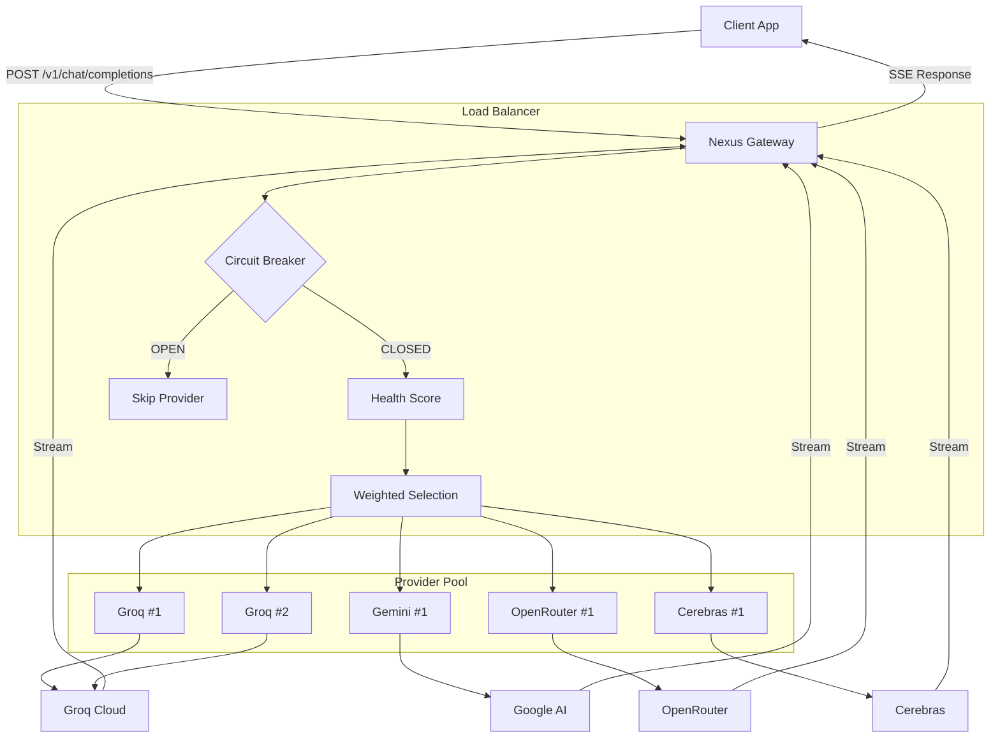

# 🚀 Nexus AI Gateway

**Production-ready AI Gateway** with health-aware load balancing, circuit breaker pattern, and graceful shutdown. Built with Bun and TypeScript for maximum performance.

[](https://bun.sh)
[](https://typescriptlang.org)
[](LICENSE)

> 🌐 **Live Demo:** [api.ramsesdb.tech](https://api.ramsesdb.tech/health)

---

## ✨ Features

| Feature | Description |
|---------|-------------|
| 🔄 **Multi-Provider Load Balancing** | Route requests across Groq, Gemini, OpenRouter, and Cerebras |
| 📊 **Health-Aware Routing** | Prioritizes healthy providers based on success rate and latency |
| ⚡ **Circuit Breaker** | Isolates failing providers to prevent cascade failures |
| 🔁 **Exponential Backoff** | Smart retry delays to avoid overwhelming services |
| 🛑 **Graceful Shutdown** | Clean termination for Kubernetes/Docker deployments |
| 🖼️ **Multimodal Support** | Text and image inputs for Llama 4 and Gemini |
| 🔌 **OpenAI-Compatible API** | Drop-in replacement for OpenAI clients |
| 🔑 **Key Pooling** | Multiple API keys per provider to bypass rate limits |

---

## 🏗️ Architecture



---

## 🚀 Quick Start

### Prerequisites

- [Bun](https://bun.sh) 1.0+
- API keys from at least one provider

### Installation

```bash
# Clone the repository
git clone https://github.com/ramsesdb/nexus-ai-gateway.git
cd nexus-ai-gateway

# Install dependencies
bun install

# Configure environment
cp .env.example .env
# Edit .env with your API keys
```

### Running

```bash
# Development (with hot reload)
bun run dev

# Production
bun run start

# Build optimized bundle
bun run build
bun run start:prod
```

---

## 📡 API Reference

### Endpoints

| Method | Path | Description |
|--------|------|-------------|
| `GET` | `/health` | Health check with provider metrics |
| `GET` | `/v1/models` | List available models |
| `POST` | `/v1/chat/completions` | Chat completion (streaming) |
| `POST` | `/v1/providers/toggle` | Enable/disable a provider instance |

### Chat Completion

**Request:**

```bash
curl -X POST http://localhost:3000/v1/chat/completions \
  -H "Content-Type: application/json" \
  -H "X-Routing-Mode: smart" \
  -d '{
    "messages": [
      {"role": "system", "content": "You are a helpful assistant"},
      {"role": "user", "content": "Hello!"}
    ]
  }'
```

**Response (SSE):**

```
data: {"id":"chatcmpl-xxx","object":"chat.completion.chunk","model":"Groq (Key #1)","choices":[{"delta":{"content":"Hello"},"index":0}]}

data: {"id":"chatcmpl-xxx","object":"chat.completion.chunk","model":"Groq (Key #1)","choices":[{"delta":{"content":"!"},"index":0}]}

data: [DONE]
```

### Multimodal (Images)

```bash
curl -X POST http://localhost:3000/v1/chat/completions \
  -H "Content-Type: application/json" \
  -d '{
    "messages": [{
      "role": "user",
      "content": [
        {"type": "text", "text": "What do you see?"},
        {"type": "image_url", "image_url": {"url": "data:image/jpeg;base64,..."}}
      ]
    }]
  }'
```

### Health Check

```bash
curl http://localhost:3000/health
```

**Response:**

```json
{
  "status": "healthy",
  "version": "1.0.0",
  "inFlightRequests": 3,
  "providers": [
    {
      "name": "Groq (Key #1)",
      "circuitState": "CLOSED",
      "enabled": true,
      "metrics": {
        "totalRequests": 150,
        "successRate": "98.0%",
        "avgLatencyMs": 450,
        "healthScore": "92.5%"
      }
    }
  ]
}

---

### Provider Toggle (Control Center)

Enable/disable a specific provider instance by its `name` (as shown in `/health`).

```bash
curl -X POST http://localhost:3000/v1/providers/toggle \
  -H "Content-Type: application/json" \
  -d '{
    "name": "Groq (Key #1)",
    "enabled": false
  }'
```

> **Security note:** if you expose this gateway publicly, protect this endpoint (token/auth + restricted CORS).
```

---

## ⚙️ Configuration

### Environment Variables

```bash
# Server
PORT=3000
CORS_ORIGIN=*

# Timeouts
FIRST_TOKEN_TIMEOUT_MS=8000
SHUTDOWN_TIMEOUT_MS=10000

# Groq (default: llama-4-scout)
GROQ_MODEL=llama-4-scout-17b-16e-instruct
GROQ_KEY_1=gsk_...
GROQ_KEY_2=gsk_...

# Gemini (default: gemini-2.5-flash)
GEMINI_MODEL=gemini-2.5-flash
GEMINI_KEY_1=AIza...

# OpenRouter (default: deepseek-r1-0528)
OPENROUTER_MODEL=deepseek/deepseek-r1-0528:free
OPENROUTER_KEY_1=sk-or-v1-...

# Cerebras (default: zai-glm-4.7)
CEREBRAS_MODEL=zai-glm-4.7
CEREBRAS_KEY_1=...

### Routing Modes

You can influence routing behavior per request via header:

`X-Routing-Mode: smart | fastest | round-robin`

- `smart` (default): weighted selection using health score + circuit breaker state
- `fastest`: pick the highest-scored provider among available
- `round-robin`: cycle through available providers (still respects `enabled` + circuit breaker)
```

### Available Models (2026)

| Provider | Model | Context | Multimodal |
|----------|-------|---------|------------|
| **Groq** | `llama-4-scout-17b-16e-instruct` | 10M | ✅ |
| **Groq** | `llama-4-maverick` | 1M | ✅ |
| **Gemini** | `gemini-2.5-flash` | 1M | ✅ |
| **Gemini** | `gemini-3-flash-preview` | 1M | ✅ |
| **OpenRouter** | `deepseek/deepseek-r1-0528:free` | 64K | ❌ |
| **Cerebras** | `zai-glm-4.7` | 128K | ❌ |

---

## 🛡️ Production Features

### Circuit Breaker

Prevents cascade failures by isolating unhealthy providers:

```
CLOSED ─(3 failures)→ OPEN ─(60s)→ HALF_OPEN ─(success)→ CLOSED
                        ↑                          │
                        └─────────(failure)────────┘
```

### Graceful Shutdown

Handles `SIGTERM` and `SIGINT` for clean Kubernetes/Docker termination:

1. Stops accepting new connections
2. Waits for in-flight requests (max 10s)
3. Returns `503` for new requests during shutdown

### Exponential Backoff

Retry delays: `100ms → 200ms → 400ms → 800ms → 1600ms → 2000ms (max)`

---

## 🐳 Deployment

### Docker

```dockerfile
FROM oven/bun:1

WORKDIR /app
COPY package.json bun.lock ./
RUN bun install --frozen-lockfile

COPY . .
RUN bun run build

EXPOSE 3000
CMD ["bun", "run", "start:prod"]
```

### Kubernetes

```yaml
apiVersion: apps/v1
kind: Deployment
spec:
  template:
    spec:
      containers:
      - name: gateway
        image: nexus-ai-gateway:1.0.0
        ports:
        - containerPort: 3000
        livenessProbe:
          httpGet:
            path: /health
            port: 3000
        readinessProbe:
          httpGet:
            path: /health
            port: 3000
        terminationGracePeriodSeconds: 15
```

### Railway / Render

The included `nixpacks.toml` handles deployment automatically.

---

## 📁 Project Structure

```
nexus-ai-gateway/
├── index.ts              # Main server with load balancer
├── types.ts              # TypeScript types (multimodal support)
├── services/
│   ├── base.ts           # Base class for OpenAI-compatible APIs
│   ├── groq.ts           # Groq (Llama 4)
│   ├── gemini.ts         # Google Gemini
│   ├── openrouter.ts     # OpenRouter (DeepSeek, etc.)
│   └── cerebras.ts       # Cerebras (GLM)
├── package.json
├── .env.example
└── nixpacks.toml         # Deployment config
```

---

## 🤝 Credits

Inspired by [midudev/bun-ai-api](https://github.com/midudev/bun-ai-api)

---

## 📄 License

MIT License - feel free to use in your projects!
