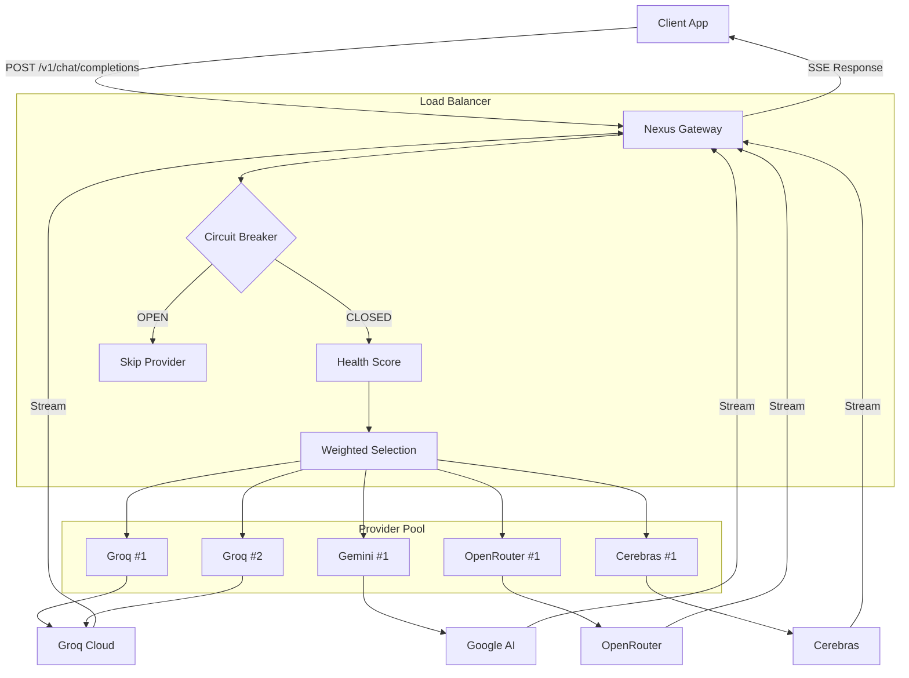

# 🚀 Nexus AI Gateway

**Production-ready AI Gateway** with health-aware load balancing, circuit breaker pattern, and graceful shutdown. Built with Bun and TypeScript for maximum performance.

[](https://bun.sh)
[](https://typescriptlang.org)
[](LICENSE)

> 🌐 **Live Demo:** [api.ramsesdb.tech](https://api.ramsesdb.tech/health)

---

## ✨ Features

| Feature | Description |
|---------|-------------|
| 🔄 **Multi-Provider Load Balancing** | Route requests across Groq, Gemini, OpenRouter, and Cerebras |
| 📊 **Health-Aware Routing** | Prioritizes healthy providers based on success rate and latency |
| ⚡ **Circuit Breaker** | Isolates failing providers to prevent cascade failures |
| 🔁 **Exponential Backoff** | Smart retry delays to avoid overwhelming services |
| 🛑 **Graceful Shutdown** | Clean termination for Kubernetes/Docker deployments |
| 🖼️ **Multimodal Support** | Text and image inputs for Llama 4 and Gemini |
| 🔌 **OpenAI-Compatible API** | Drop-in replacement for OpenAI clients |
| 🔑 **Key Pooling** | Multiple API keys per provider to bypass rate limits |

---

## 🏗️ Architecture


```mermaid
graph TD
    Client[Client App] -->|POST /v1/chat/completions| Gateway[Nexus Gateway]
    
    subgraph "Load Balancer"
        Gateway --> CB{Circuit Breaker}
        CB -->|CLOSED| Score[Health Score]
        CB -->|OPEN| Skip[Skip Provider]
        Score --> Select[Weighted Selection]
    end
    
    subgraph "Provider Pool"
        Select --> G1[Groq #1]
        Select --> G2[Groq #2]
        Select --> GM1[Gemini #1]
        Select --> OR1[OpenRouter #1]
        Select --> C1[Cerebras #1]
    end
    
    G1 & G2 --> Groq[Groq Cloud]
    GM1 --> Google[Google AI]
    OR1 --> OpenRouter[OpenRouter]
    C1 --> Cerebras[Cerebras]
    
    Groq & Google & OpenRouter & Cerebras -->|Stream| Gateway
    Gateway -->|SSE Response| Client
```

---

## 🚀 Quick Start

### Prerequisites

- [Bun](https://bun.sh) 1.0+
- API keys from at least one provider

### Installation

```bash
# Clone the repository
git clone https://github.com/ramsesdb/nexus-ai-gateway.git
cd nexus-ai-gateway

# Install dependencies
bun install

# Configure environment
cp .env.example .env
# Edit .env with your API keys
```

### Running

```bash
# Development (with hot reload)
bun run dev

# Production
bun run start

# Build optimized bundle
bun run build
bun run start:prod
```

---

## 📡 API Reference

### Endpoints

| Method | Path | Description |
|--------|------|-------------|
| `GET` | `/health` | Health check with provider metrics |
| `GET` | `/v1/models` | List available models |
| `POST` | `/v1/chat/completions` | Chat completion (streaming) |
| `POST` | `/v1/providers/toggle` | Enable/disable a provider instance |

### Chat Completion

**Request:**

```bash
curl -X POST http://localhost:3000/v1/chat/completions \
  -H "Content-Type: application/json" \
  -H "X-Routing-Mode: smart" \
  -d '{
    "messages": [
      {"role": "system", "content": "You are a helpful assistant"},
      {"role": "user", "content": "Hello!"}
    ]
  }'
```

**Response (SSE):**

```
data: {"id":"chatcmpl-xxx","object":"chat.completion.chunk","model":"Groq (Key #1)","choices":[{"delta":{"content":"Hello"},"index":0}]}

data: {"id":"chatcmpl-xxx","object":"chat.completion.chunk","model":"Groq (Key #1)","choices":[{"delta":{"content":"!"},"index":0}]}

data: [DONE]
```

### Multimodal (Images)

```bash
curl -X POST http://localhost:3000/v1/chat/completions \
  -H "Content-Type: application/json" \
  -d '{
    "messages": [{
      "role": "user",
      "content": [
        {"type": "text", "text": "What do you see?"},
        {"type": "image_url", "image_url": {"url": "data:image/jpeg;base64,..."}}
      ]
    }]
  }'
```

### Health Check

```bash
curl http://localhost:3000/health
```

**Response:**

```json
{
  "status": "healthy",
  "version": "1.0.0",
  "inFlightRequests": 3,
  "providers": [
    {
      "name": "Groq (Key #1)",
      "circuitState": "CLOSED",
      "enabled": true,
      "metrics": {
        "totalRequests": 150,
        "successRate": "98.0%",
        "avgLatencyMs": 450,
        "healthScore": "92.5%"
      }
    }
  ]
}

---

### Provider Toggle (Control Center)

Enable/disable a specific provider instance by its `name` (as shown in `/health`).

```bash
curl -X POST http://localhost:3000/v1/providers/toggle \
  -H "Content-Type: application/json" \
  -d '{
    "name": "Groq (Key #1)",
    "enabled": false
  }'
```

> **Security note:** if you expose this gateway publicly, protect this endpoint (token/auth + restricted CORS).
```

---

### Error Responses

All error responses follow the OpenAI-compatible shape, with a stable
machine-readable `code` field:

```json
{ "error": { "message": "...", "type": "...", "code": "QUOTA_EXCEEDED" } }
```

Branch on `code` rather than `message` (which is human-readable). The `type`
field is preserved for backward compatibility with OpenAI SDKs.

| `code` | HTTP | Meaning |
|---|---|---|
| `INVALID_REQUEST` | 400 | Malformed body, missing required fields, or a model the gateway cannot route |
| `NO_PROVIDER_AVAILABLE` | 400 | No configured provider can serve the requested model |
| `AUTH_INVALID` | 401 | Missing, invalid, or expired bearer token / dashboard session |
| `AUTH_FORBIDDEN` | 403 | Reserved — credentials are valid but lack the required scope |
| `NOT_FOUND` | 404 | Token id, provider name, or other named resource does not exist |
| `QUOTA_EXCEEDED` | 429 | Per-user token has used its monthly quota |
| `RATE_LIMITED` | 429 | Gateway-imposed rate limit (see [Rate Limiting](#rate-limiting)) |
| `INTERNAL_ERROR` | 500 | Unhandled exception inside the gateway |
| `UPSTREAM_ERROR` | 502 | All compatible providers failed after retries (or, in streaming mode, mid-flight failure event) |
| `SERVICE_UNAVAILABLE` | 503 | Server is shutting down or the database is unreachable |
| `CIRCUIT_OPEN` | 503 | Pinned model is unavailable because its circuit breaker is open |

For streaming requests (`text/event-stream`), an upstream failure that occurs
after the SSE stream has already started is delivered as a single
`data: { "error": { ..., "code": "UPSTREAM_ERROR" } }` event followed by
`[DONE]`.

---

### Rate Limiting

The gateway enforces a per-token token-bucket rate limit on `/v1/chat/completions`
and `/v1/models` for token-authenticated requests. Master key and dashboard
session requests bypass the limiter.

**Defaults (env):**

- `RATE_LIMIT_PER_MINUTE_DEFAULT` (default: `60`)
- `RATE_LIMIT_BURST_DEFAULT` (default: `20`)
- `RATE_LIMIT_DISABLED=1` disables the limiter globally (requires restart).

**Per-token overrides (admin API):**

- `ratePerMinute`: integer or `null` (use default)
- `rateBurst`: integer or `null` (use default)
- `rateLimitDisabled`: boolean (bypass limiter for this token)

**Headers (delta-seconds, not Unix timestamps):**

- `X-RateLimit-Limit`: effective per-minute capacity
- `X-RateLimit-Remaining`: floor of current tokens after consume
- `X-RateLimit-Reset`: seconds until bucket is full

**429 shape + retry:**

- Response body includes `error.code = "RATE_LIMITED"`, `retry_after_seconds`,
  `limit`, `remaining: 0`, `window: "minute"`.
- `Retry-After` is a delta-seconds integer (not an HTTP-date).

**Caveats:**

- Buckets are in-memory and reset on process restart (all tokens get full burst).
- Multi-instance deployments are NOT safe with this design (effective limit
  becomes N × configured limit).

**Testing:**

- Unit tests: `bun test` (uses bun:test).
- Integration test for `/v1/chat/completions` rate limiting is not automated yet.

**Manual smoke checks (recommended):**

- Set `RATE_LIMIT_DISABLED=1`, restart, and confirm no `X-RateLimit-*` headers
  and no 429s from the limiter.
- With defaults, send 21 requests in 1s to `/v1/models` with the same token;
  expect 20 OK and then one 429 `RATE_LIMITED`.

**Admin API example (per-token override):**

```bash
curl -X PATCH http://localhost:3000/admin/tokens/123 \
  -H "Authorization: Bearer $NEXUS_MASTER_KEY" \
  -H "Content-Type: application/json" \
  -d '{ "ratePerMinute": 30 }'
```

### Error Handling and Retry Classification

When an upstream provider returns an error, the gateway classifies it as either
`retryable` (rotate to the next compatible provider in the pool) or `failFast`
(return an error to the client immediately, without burning latency on doomed
retries). The classifier lives in `services/retry-classifier.ts` and is invoked
by both the streaming and non-streaming paths of `/v1/chat/completions`.

| Upstream status | Decision | Client `code` | Client HTTP | Notes |
|---|---|---|---|---|
| 400 | failFast | `INVALID_REQUEST` | 400 | Body parsed defensively for `error.message` |
| 422 | failFast | `INVALID_REQUEST` | 400 | Mapped to 400 to align with the OpenAI shape |
| 413 | failFast | `INVALID_REQUEST` | 413 | Status preserved (payload too large) |
| 404 | failFast | `INVALID_REQUEST` | 400 | Treated as model-not-found |
| 401 / 403 | failFast | `UPSTREAM_ERROR` | 502 | Generic surface message — body NOT echoed (avoids leaking gateway API keys) |
| 408 | retryable | — | — | Upstream request timeout |
| 409 | retryable | — | — | Defensive — rare in practice |
| 429 | retryable | — | — | Provider rate limited; rotate keys |
| 5xx | retryable | — | — | All 500-class statuses |
| network / fetch failure | retryable | — | — | DNS, ECONNRESET, etc. |
| timeout | retryable | — | — | Includes the gateway's first-token timeout |

When all compatible providers exhaust the retryable pool, the gateway returns
`502 UPSTREAM_ERROR` (non-streaming) or emits a single SSE error event with
`code: "UPSTREAM_ERROR"` followed by `[DONE]` (streaming).

**Known limitation:** some providers respond `200 OK` with an embedded error
object on policy violations. The gateway currently treats this as success;
clients must check `error` in the response body themselves. Planned for a
future change.

**Metric:** `gateway_retry_decisions_total{provider, decision, http_status_class}`
counts classifier decisions; `decision` is `retryable | failFast` and
`http_status_class` is `4xx | 5xx | network | timeout | other`.

### Observability

The gateway emits **structured JSON logs** (one event per line) and exposes a
**Prometheus-compatible `/metrics` endpoint**.

#### Logs

Every log line includes `service: "nexus-gateway"`. Lines emitted from the
chat-completions hot path additionally carry a `trace_id` (UUID) so a single
request's routing decisions, retries, and circuit-breaker transitions can be
correlated. Example:

```json
{"level":30,"time":1714330000123,"service":"nexus-gateway","trace_id":"5e1f...","path":"/v1/chat/completions","method":"POST","tag":"Router","model":"openai/gpt-4.1-mini","rule":"openai/*","candidates":["OpenRouter (Key #1)","Gemini (Key #1)","Groq (Key #1)"],"msg":"[Router] model=openai/gpt-4.1-mini rule=openai/* candidates=[OpenRouter (Key #1), Gemini (Key #1), Groq (Key #1)]"}
```

Configuration (env):

| Variable | Default | Effect |
|---|---|---|
| `LOG_LEVEL` | `info` | `trace`/`debug`/`info`/`warn`/`error`/`fatal` |
| `DEBUG=1` | unset | Legacy alias — sets level to `debug` if `LOG_LEVEL` is unset |
| `NODE_ENV=production` | unset | Disables `pino-pretty`; emits raw JSON for log shippers |

In dev (`NODE_ENV !== production`), logs are pretty-printed with colors via
`pino-pretty`. Authorization/cookie headers and `*.api_key` / `*.password`
fields are redacted automatically.

#### Metrics

`GET /metrics` returns Prometheus exposition format. Set `METRICS_TOKEN=<token>`
to require `Authorization: Bearer <token>` on the endpoint (otherwise it is
open — assume your scraper sits on a private network).

Exposed metrics:

| Metric | Type | Labels |
|---|---|---|
| `gateway_requests_total` | counter | `method`, `path`, `status`, `error_code` |
| `gateway_request_duration_ms` | histogram | `method`, `path`, `status` |
| `gateway_upstream_requests_total` | counter | `provider`, `model`, `status`, `outcome` (`success`/`failed`) |
| `gateway_upstream_first_token_ms` | histogram | `provider` |
| `gateway_circuit_breaker_state` | gauge (0=closed, 1=open, 2=half-open) | `provider` |
| `gateway_active_streams` | gauge | — |
| `gateway_ratelimit_total` | counter | `token_label`, `outcome` (`allowed`/`rejected`) |

For `gateway_ratelimit_total`, keep `token_label` cardinality under ~50 tokens
per deployment to avoid high label churn.

Plus the default Node/Bun process metrics (`process_cpu_*`, `nodejs_eventloop_lag_seconds`, `nodejs_heap_size_*`, etc.) auto-collected by `prom-client`.

Example Prometheus scrape config:

```yaml
scrape_configs:
  - job_name: nexus-gateway
    metrics_path: /metrics
    scheme: https
    static_configs:
      - targets: ['api.ramsesdb.tech']
    authorization:
      type: Bearer
      credentials: <METRICS_TOKEN>
```

---

## ⚙️ Configuration

### Environment Variables

```bash
# Server
PORT=3000
CORS_ORIGIN=*

# Timeouts
FIRST_TOKEN_TIMEOUT_MS=8000
SHUTDOWN_TIMEOUT_MS=10000

# Debug logs (off by default; set to 1 to surface incoming request + provider 4xx/5xx bodies)
DEBUG=0

# Rate limiting (per-token)
RATE_LIMIT_PER_MINUTE_DEFAULT=60
RATE_LIMIT_BURST_DEFAULT=20
RATE_LIMIT_DISABLED=0

# Groq (default: llama-4-scout)
GROQ_MODEL=llama-4-scout-17b-16e-instruct
GROQ_KEY_1=gsk_...
GROQ_KEY_2=gsk_...

# Gemini (default: gemini-2.5-flash)
GEMINI_MODEL=gemini-2.5-flash
GEMINI_KEY_1=AIza...

# OpenRouter (default: deepseek-r1-0528)
OPENROUTER_MODEL=deepseek/deepseek-r1-0528:free
OPENROUTER_KEY_1=sk-or-v1-...

# Cerebras (default: zai-glm-4.7)
CEREBRAS_MODEL=zai-glm-4.7
CEREBRAS_KEY_1=...

### Routing Modes

You can influence routing behavior per request via header:

`X-Routing-Mode: smart | fastest | round-robin`

- `smart` (default): weighted selection using health score + circuit breaker state
- `fastest`: pick the highest-scored provider among available
- `round-robin`: cycle through available providers (still respects `enabled` + circuit breaker)
```

### Available Models (2026)

| Provider | Model | Context | Multimodal |
|----------|-------|---------|------------|
| **Groq** | `llama-4-scout-17b-16e-instruct` | 10M | ✅ |
| **Groq** | `llama-4-maverick` | 1M | ✅ |
| **Gemini** | `gemini-2.5-flash` | 1M | ✅ |
| **Gemini** | `gemini-3-flash-preview` | 1M | ✅ |
| **OpenRouter** | `deepseek/deepseek-r1-0528:free` | 64K | ❌ |
| **Cerebras** | `zai-glm-4.7` | 128K | ❌ |

---

## 🛡️ Production Features

### Circuit Breaker

Prevents cascade failures by isolating unhealthy providers:

```
CLOSED ─(3 failures)→ OPEN ─(60s)→ HALF_OPEN ─(success)→ CLOSED
                        ↑                          │
                        └─────────(failure)────────┘
```

### Graceful Shutdown

Handles `SIGTERM` and `SIGINT` for clean Kubernetes/Docker termination:

1. Stops accepting new connections
2. Waits for in-flight requests (max 10s)
3. Returns `503` for new requests during shutdown

### Exponential Backoff

Retry delays: `100ms → 200ms → 400ms → 800ms → 1600ms → 2000ms (max)`

---

## 🐳 Deployment

### Docker

```dockerfile
FROM oven/bun:1

WORKDIR /app
COPY package.json bun.lock ./
RUN bun install --frozen-lockfile

COPY . .
RUN bun run build

EXPOSE 3000
CMD ["bun", "run", "start:prod"]
```

### Kubernetes

```yaml
apiVersion: apps/v1
kind: Deployment
spec:
  template:
    spec:
      containers:
      - name: gateway
        image: nexus-ai-gateway:1.0.0
        ports:
        - containerPort: 3000
        livenessProbe:
          httpGet:
            path: /health
            port: 3000
        readinessProbe:
          httpGet:
            path: /health
            port: 3000
        terminationGracePeriodSeconds: 15
```

### Railway / Render

The included `nixpacks.toml` handles deployment automatically.

---

## 📁 Project Structure

```
nexus-ai-gateway/
├── index.ts              # Main server with load balancer
├── types.ts              # TypeScript types (multimodal support)
├── services/
│   ├── base.ts           # Base class for OpenAI-compatible APIs
│   ├── groq.ts           # Groq (Llama 4)
│   ├── gemini.ts         # Google Gemini
│   ├── openrouter.ts     # OpenRouter (DeepSeek, etc.)
│   └── cerebras.ts       # Cerebras (GLM)
├── package.json
├── .env.example
└── nixpacks.toml         # Deployment config
```

---

## 🤝 Credits

Inspired by [midudev/bun-ai-api](https://github.com/midudev/bun-ai-api)

---

## 📄 License

MIT License - feel free to use in your projects!
